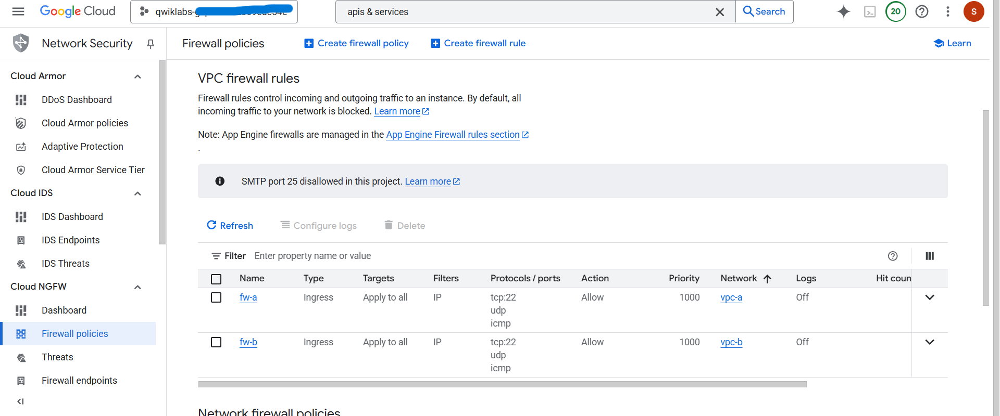

# Lab 2: Configuring Network Connectivity Center as a Transit Hub

**Date done:** 11th August 2025  

## Tasks
1. Create vpc-transit  
2. Create remote branch office VPCs  
3. Configure HA VPN between the remote branch office VPCs and the transit hub VPC  
4. Create NCC hub resources and attach the HA VPNs as spokes  
5. Test the setup end-to-end deploying VMs in the remote branch office VPCs  

## Screenshots
  
  
  
  
  
  
  
  
